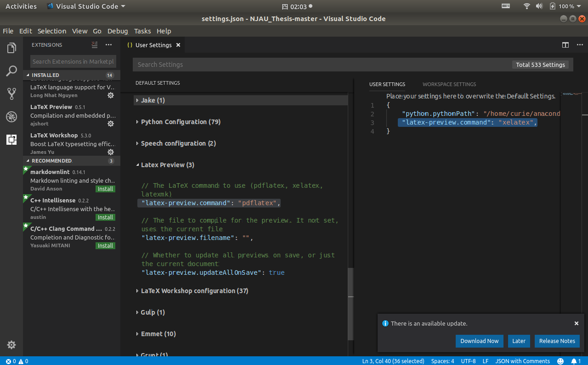

# NJAU_Thesis

南京农业大学本科生毕业论文LaTeX模板 理工科版

frankwaiichou个人制作，根据其当年毕业论文改编。

版权归frankwaiichou@126.com所有

-----------------
使用vscode作为latex环境时，注意其扩展所用的latex引擎是对中文支持不好的pdflatex,应当在Setting中将默认的latex引擎由pdflatex改为xelatex.这样Preview会是正常的．

